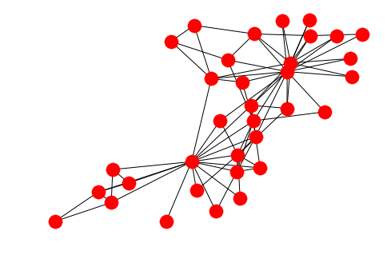
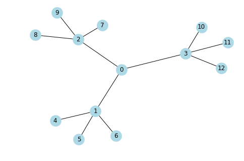
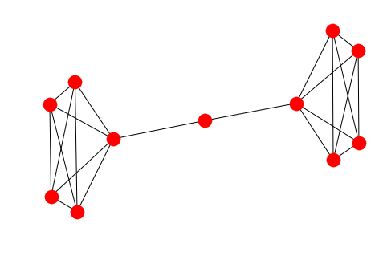
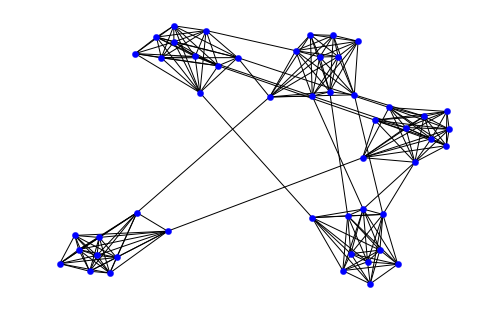
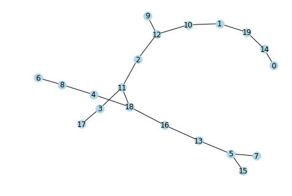
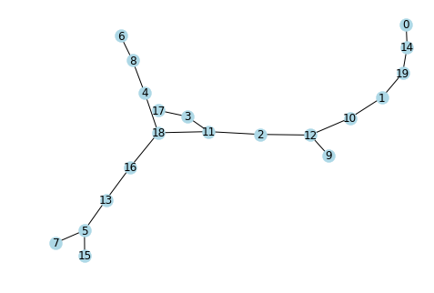
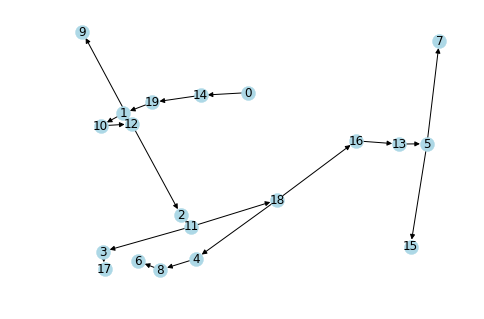

## Algorithms - I

### Distance, Centrality, Community and Traversal


```python
import matplotlib.pyplot as plt
import networkx as nx
import seaborn as sns
sns.set()
%matplotlib inline
```


```python
import warnings
import matplotlib.cbook
warnings.filterwarnings("ignore",category=matplotlib.cbook.mplDeprecation)
```


```python
G = nx.karate_club_graph()
nx.draw(G)
```





### 1. Distance

Graph diameter, radius, eccentricity and other properties.

- ```center(G[, e, usebounds])``` 	Returns the center of the graph G.
- ```diameter(G[, e, usebounds])``` 	Returns the diameter of the graph G.
- ```eccentricity(G[, v, sp])``` 	Returns the eccentricity of nodes in G.
- ```extrema_bounding(G[, compute])``` 	Compute requested extreme distance metric of undirected graph G
- ```periphery(G[, e, usebounds])``` 	Returns the periphery of the graph G.
- ```radius(G[, e, usebounds])``` 	Returns the radius of the graph G.


```python
nx.radius(G), nx.diameter(G)
```


    (3, 5)


```python
nx.center(G)
```


    [0, 1, 2, 3, 8, 13, 19, 31]


```python
nx.eccentricity(G)
```


    {0: 3,
     1: 3,
     2: 3,
     3: 3,
     4: 4,
     5: 4,
     6: 4,
     7: 4,
     8: 3,
     9: 4,
     10: 4,
     11: 4,
     12: 4,
     13: 3,
     14: 5,
     15: 5,
     16: 5,
     17: 4,
     18: 5,
     19: 3,
     20: 5,
     21: 4,
     22: 5,
     23: 5,
     24: 4,
     25: 4,
     26: 5,
     27: 4,
     28: 4,
     29: 5,
     30: 4,
     31: 3,
     32: 4,
     33: 4}


```python
nx.extrema_bounding(G)
```


    5


```python
nx.periphery(G)
```


    [14, 15, 16, 18, 20, 22, 23, 26, 29]


-----------

### Centrality

#### Degree

- ```degree_centrality(G)``` 	Compute the degree centrality for nodes.
- ```in_degree_centrality(G)``` 	Compute the in-degree centrality for nodes.
- ```out_degree_centrality(G)``` 	Compute the out-degree centrality for nodes.


```python
G = nx.balanced_tree(r=3, h=2) 
nx.draw(G, node_size = 500,node_color = 'lightblue', with_labels =True)
```





```python
nx.degree_centrality(G)
```


    {0: 0.25,
     1: 0.3333333333333333,
     2: 0.3333333333333333,
     3: 0.3333333333333333,
     4: 0.08333333333333333,
     5: 0.08333333333333333,
     6: 0.08333333333333333,
     7: 0.08333333333333333,
     8: 0.08333333333333333,
     9: 0.08333333333333333,
     10: 0.08333333333333333,
     11: 0.08333333333333333,
     12: 0.08333333333333333}


```python
nx.in_degree_centrality(nx.to_directed(G))
```


    {0: 0.25,
     1: 0.3333333333333333,
     2: 0.3333333333333333,
     3: 0.3333333333333333,
     4: 0.08333333333333333,
     5: 0.08333333333333333,
     6: 0.08333333333333333,
     7: 0.08333333333333333,
     8: 0.08333333333333333,
     9: 0.08333333333333333,
     10: 0.08333333333333333,
     11: 0.08333333333333333,
     12: 0.08333333333333333}


```python
nx.out_degree_centrality(nx.to_directed(G))
```


    {0: 0.25,
     1: 0.3333333333333333,
     2: 0.3333333333333333,
     3: 0.3333333333333333,
     4: 0.08333333333333333,
     5: 0.08333333333333333,
     6: 0.08333333333333333,
     7: 0.08333333333333333,
     8: 0.08333333333333333,
     9: 0.08333333333333333,
     10: 0.08333333333333333,
     11: 0.08333333333333333,
     12: 0.08333333333333333}


-------

#### Eigenvector Centality

- ```eigenvector_centrality(G[, max_iter, tol, …])``` 	Compute the eigenvector centrality for the graph G.
- ```eigenvector_centrality_numpy(G[, weight, …])``` 	Compute the eigenvector centrality for the graph G.
- ```katz_centrality(G[, alpha, beta, max_iter, …])``` 	Compute the Katz centrality for the nodes of the graph G.
- ```katz_centrality_numpy(G[, alpha, beta, …])``` 	Compute the Katz centrality for the graph G.


```python
nx.eigenvector_centrality(G)
```


    {0: 0.49999972705204543,
     1: 0.40824851115143324,
     2: 0.40824851115143324,
     3: 0.40824851115143324,
     4: 0.16666657745857444,
     5: 0.16666657745857444,
     6: 0.16666657745857444,
     7: 0.16666657745857444,
     8: 0.16666657745857444,
     9: 0.16666657745857444,
     10: 0.16666657745857444,
     11: 0.16666657745857444,
     12: 0.16666657745857444}


```python
nx.katz_centrality(G)
```


    {0: 0.31855094383728,
     1: 0.3279200842087277,
     2: 0.3279200842087277,
     3: 0.3279200842087277,
     4: 0.2529669612371458,
     5: 0.2529669612371458,
     6: 0.2529669612371458,
     7: 0.2529669612371458,
     8: 0.2529669612371458,
     9: 0.2529669612371458,
     10: 0.2529669612371458,
     11: 0.2529669612371458,
     12: 0.2529669612371458}


-----------

#### Betweenness Centrality

- ```betweenness_centrality(G[, k, normalized, …])``` 	Compute the shortest-path betweenness centrality for nodes.
- ```edge_betweenness_centrality(G[, k, …])``` 	Compute betweenness centrality for edges.
- ```betweenness_centrality_subset(G, sources, …)``` 	Compute betweenness centrality for a subset of nodes.
- ```edge_betweenness_centrality_subset(G, …[, …])``` 	Compute betweenness centrality for edges for a subset of nodes.


```python
nx.betweenness_centrality(G)
```


    {0: 0.7272727272727273,
     1: 0.4545454545454546,
     2: 0.4545454545454546,
     3: 0.4545454545454546,
     4: 0.0,
     5: 0.0,
     6: 0.0,
     7: 0.0,
     8: 0.0,
     9: 0.0,
     10: 0.0,
     11: 0.0,
     12: 0.0}


----------------

### 2. Community

Functions for computing and measuring community structure.

The functions in this class are not imported into the top-level networkx namespace. You can access these functions by importing the ```networkx.algorithms.community``` module, then accessing the functions as attributes of community. For example:


```python
from networkx.algorithms import community

G = nx.barbell_graph(5, 1)
nx.draw(G)
```





```python
communities_generator = community.girvan_newman(G)

top_level_communities = next(communities_generator)
next_level_communities = next(communities_generator)

sorted(map(sorted, next_level_communities))

```


    [[0, 1, 2, 3, 4], [5], [6, 7, 8, 9, 10]]


--------

#### K-Clique Communty


```python
G = nx.relaxed_caveman_graph(5,10,0.1)
nx.draw(G, node_size = 40,node_color = 'blue')
```





```python
from networkx.algorithms.community import k_clique_communities
c = list(k_clique_communities(G,k=4))
print(c)
```

    [frozenset({0, 1, 2, 3, 4, 5, 6, 7, 8, 9}), frozenset({10, 11, 12, 13, 14, 15, 16, 17, 18, 19}), frozenset({20, 21, 22, 23, 24, 25, 26, 27, 28, 29}), frozenset({32, 33, 34, 35, 36, 37, 38, 39, 30, 31}), frozenset({40, 41, 42, 43, 44, 45, 46, 47, 48, 49})]
    


```python
from networkx.algorithms.community import greedy_modularity_communities
c = list(greedy_modularity_communities(G))
print(c)
```

    [frozenset({0, 1, 2, 3, 4, 5, 6, 7, 8, 9}), frozenset({10, 11, 12, 13, 14, 15, 16, 17, 18, 19}), frozenset({20, 21, 22, 23, 24, 25, 26, 27, 28, 29}), frozenset({32, 33, 34, 35, 36, 37, 38, 39, 30, 31}), frozenset({40, 41, 42, 43, 44, 45, 46, 47, 48, 49})]
    


```python
from networkx.algorithms.community import asyn_lpa_communities
c = list(asyn_lpa_communities(G))
print(c)
```

    [{0, 1, 2, 3, 4, 5, 6, 7, 8, 9}, {10, 11, 12, 13, 14, 15, 16, 17, 18, 19}, {20, 21, 22, 23, 24, 25, 26, 27, 28, 29}, {32, 33, 34, 35, 36, 37, 38, 39, 30, 31}, {40, 41, 42, 43, 44, 45, 46, 47, 48, 49}]
    


```python
from networkx.algorithms.community import label_propagation_communities
c = list(label_propagation_communities(G))
print(c)
```

    [{10, 11, 12, 13, 14, 15, 16, 17, 18, 19}, {32, 33, 34, 35, 36, 37, 38, 39, 30, 31}, {0, 1, 2, 3, 4, 5, 6, 7, 8, 9}, {40, 41, 42, 43, 44, 45, 46, 47, 48, 49}, {20, 21, 22, 23, 24, 25, 26, 27, 28, 29}]
    


```python
from networkx.algorithms.community import asyn_fluidc
c = list(asyn_fluidc(G,k=5))
print(c)
```

    [{16, 17, 19, 11}, {10, 12, 13, 14, 15, 18}, {32, 33, 34, 35, 36, 37, 38, 39, 30, 31}, {0, 1, 2, 3, 4, 5, 6, 7, 40, 9, 8, 43, 44, 45, 46, 47, 48, 49, 41, 42}, {20, 21, 22, 23, 24, 25, 26, 27, 28, 29}]
    

---------

### 3 Traversal

#### 3.1 Depth First Search

Basic algorithms for depth-first searching the nodes of a graph.

- ```dfs_edges(G[, source, depth_limit])``` 	Iterate over edges in a depth-first-search (DFS).
- ```dfs_tree(G[, source, depth_limit])``` 	Returns oriented tree constructed from a depth-first-search from source.
- ```dfs_predecessors(G[, source, depth_limit])``` 	Returns dictionary of predecessors in depth-first-search from source.
- ```dfs_successors(G[, source, depth_limit])``` 	Returns dictionary of successors in depth-first-search from source.
- ```dfs_preorder_nodes(G[, source, depth_limit])``` 	Generate nodes in a depth-first-search pre-ordering starting at source.
- ```dfs_postorder_nodes(G[, source, depth_limit])``` 	Generate nodes in a depth-first-search post-ordering starting at source.
- ```dfs_labeled_edges(G[, source, depth_limit])``` 	Iterate over edges in a depth-first-search (DFS) labeled by type.


```python
G = nx.random_tree(20) 
nx.draw(G, node_size = 200,node_color = 'lightblue',with_labels=True)
```





```python
L = list(nx.dfs_edges(G, source=0, depth_limit=5))
print(L)
```

    [(0, 14), (14, 19), (19, 1), (1, 10), (10, 12)]
    


```python
TG = nx.dfs_tree(G)
nx.draw(G, node_size = 200,node_color = 'lightblue',with_labels=True)
```





```python
nx.dfs_predecessors(G, source=0)
```


    {1: 19,
     2: 12,
     3: 11,
     4: 18,
     5: 13,
     6: 8,
     7: 5,
     8: 4,
     9: 12,
     10: 1,
     11: 2,
     12: 10,
     13: 16,
     14: 0,
     15: 5,
     16: 18,
     17: 3,
     18: 11,
     19: 14}


```python
nx.dfs_successors(G, source=0)
```


    {0: [14],
     1: [10],
     2: [11],
     3: [17],
     4: [8],
     5: [7, 15],
     8: [6],
     10: [12],
     11: [3, 18],
     12: [9, 2],
     13: [5],
     14: [19],
     16: [13],
     18: [4, 16],
     19: [1]}


```python
list(nx.dfs_preorder_nodes(G))
```


    [0, 14, 19, 1, 10, 12, 9, 2, 11, 3, 17, 18, 4, 8, 6, 16, 13, 5, 7, 15]


```python
list(nx.dfs_postorder_nodes(G))
```


    [9, 17, 3, 6, 8, 4, 7, 15, 5, 13, 16, 18, 11, 2, 12, 10, 1, 19, 14, 0]


```python
list(nx.dfs_labeled_edges(G))
```


    [(0, 0, 'forward'),
     (0, 14, 'forward'),
     (14, 0, 'nontree'),
     (14, 19, 'forward'),
     (19, 14, 'nontree'),
     (19, 1, 'forward'),
     (1, 10, 'forward'),
     (10, 12, 'forward'),
     (12, 9, 'forward'),
     (9, 12, 'nontree'),
     (12, 9, 'reverse'),
     (12, 2, 'forward'),
     (2, 11, 'forward'),
     (11, 3, 'forward'),
     (3, 17, 'forward'),
     (17, 3, 'nontree'),
     (3, 17, 'reverse'),
     (3, 11, 'nontree'),
     (11, 3, 'reverse'),
     (11, 18, 'forward'),
     (18, 4, 'forward'),
     (4, 8, 'forward'),
     (8, 6, 'forward'),
     (6, 8, 'nontree'),
     (8, 6, 'reverse'),
     (8, 4, 'nontree'),
     (4, 8, 'reverse'),
     (4, 18, 'nontree'),
     (18, 4, 'reverse'),
     (18, 16, 'forward'),
     (16, 13, 'forward'),
     (13, 5, 'forward'),
     (5, 7, 'forward'),
     (7, 5, 'nontree'),
     (5, 7, 'reverse'),
     (5, 15, 'forward'),
     (15, 5, 'nontree'),
     (5, 15, 'reverse'),
     (5, 13, 'nontree'),
     (13, 5, 'reverse'),
     (13, 16, 'nontree'),
     (16, 13, 'reverse'),
     (16, 18, 'nontree'),
     (18, 16, 'reverse'),
     (18, 11, 'nontree'),
     (11, 18, 'reverse'),
     (11, 2, 'nontree'),
     (2, 11, 'reverse'),
     (2, 12, 'nontree'),
     (12, 2, 'reverse'),
     (12, 10, 'nontree'),
     (10, 12, 'reverse'),
     (10, 1, 'nontree'),
     (1, 10, 'reverse'),
     (1, 19, 'nontree'),
     (19, 1, 'reverse'),
     (14, 19, 'reverse'),
     (0, 14, 'reverse'),
     (0, 0, 'reverse')]


-----------

#### 3.2 Breadth-first search

Basic algorithms for breadth-first searching the nodes of a graph.

- ```bfs_edges(G, source[, reverse, depth_limit])``` 	Iterate over edges in a breadth-first-search starting at source.
- ```bfs_tree(G, source[, reverse, depth_limit])``` 	Returns an oriented tree constructed from of a breadth-first-search starting at source.
- ```bfs_predecessors(G, source[, depth_limit])``` 	Returns an iterator of predecessors in breadth-first-search from source.
- ```bfs_successors(G, source[, depth_limit])``` 	Returns an iterator of successors in breadth-first-search from so


```python
print(list(nx.bfs_edges(G,0)))
```

    [(0, 14), (14, 19), (19, 1), (1, 10), (10, 12), (12, 9), (12, 2), (2, 11), (11, 3), (11, 18), (3, 17), (18, 4), (18, 16), (4, 8), (16, 13), (8, 6), (13, 5), (5, 7), (5, 15)]
    


```python
nx.draw(nx.bfs_tree(G,0), node_color = 'lightblue', node_size = 200, with_labels = True)
```





```python
print(list(nx.bfs_predecessors(G,0)))
```

    [(14, 0), (19, 14), (1, 19), (10, 1), (12, 10), (9, 12), (2, 12), (11, 2), (3, 11), (18, 11), (17, 3), (4, 18), (16, 18), (8, 4), (13, 16), (6, 8), (5, 13), (7, 5), (15, 5)]
    


```python
print(list(nx.bfs_successors(G,0)))
```

    [(0, [14]), (14, [19]), (19, [1]), (1, [10]), (10, [12]), (12, [9, 2]), (2, [11]), (11, [3, 18]), (3, [17]), (18, [4, 16]), (4, [8]), (16, [13]), (8, [6]), (13, [5]), (5, [7, 15])]
    

---------
