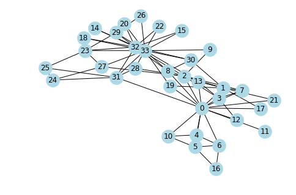
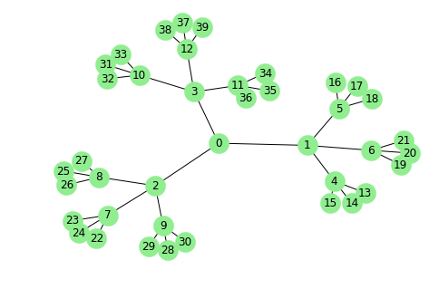
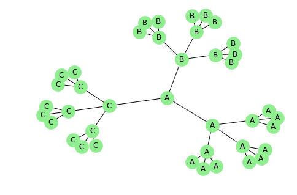
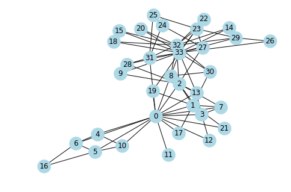

## Algorithm - II

### Clustering, Link Analysis, Node Classification, Link Prediction


```python
import matplotlib.pyplot as plt
import networkx as nx
import seaborn as sns
sns.set()
%matplotlib inline
```


```python
import warnings
import matplotlib.cbook
warnings.filterwarnings("ignore",category=matplotlib.cbook.mplDeprecation)
```


```python
G = nx.karate_club_graph()
nx.draw(G, node_size = 500, node_color = "lightblue", with_labels = True)
```





### Clustering

Algorithms to characterize the number of triangles in a graph.

- ```triangles(G[, nodes])``` 	Compute the number of triangles.
- ```transitivity(G)``` 	Compute graph transitivity, the fraction of all possible triangles present in G.
- ```clustering(G[, nodes, weight])``` 	Compute the clustering coefficient for nodes.
- ```average_clustering(G[, nodes, weight, …])``` 	Compute the average clustering coefficient for the graph G.
- ```square_clustering(G[, nodes])``` 	Compute the squares clustering coefficient for nodes.
- ```generalized_degree(G[, nodes])``` 	Compute the generalized degree for nodes.


```python
nx.triangles(G)
```


    {0: 18,
     1: 12,
     2: 11,
     3: 10,
     4: 2,
     5: 3,
     6: 3,
     7: 6,
     8: 5,
     9: 0,
     10: 2,
     11: 0,
     12: 1,
     13: 6,
     14: 1,
     15: 1,
     16: 1,
     17: 1,
     18: 1,
     19: 1,
     20: 1,
     21: 1,
     22: 1,
     23: 4,
     24: 1,
     25: 1,
     26: 1,
     27: 1,
     28: 1,
     29: 4,
     30: 3,
     31: 3,
     32: 13,
     33: 15}


```python
nx.transitivity(G)
```


    0.2556818181818182


```python
nx.clustering(G)
```


    {0: 0.15,
     1: 0.3333333333333333,
     2: 0.24444444444444444,
     3: 0.6666666666666666,
     4: 0.6666666666666666,
     5: 0.5,
     6: 0.5,
     7: 1.0,
     8: 0.5,
     9: 0,
     10: 0.6666666666666666,
     11: 0,
     12: 1.0,
     13: 0.6,
     14: 1.0,
     15: 1.0,
     16: 1.0,
     17: 1.0,
     18: 1.0,
     19: 0.3333333333333333,
     20: 1.0,
     21: 1.0,
     22: 1.0,
     23: 0.4,
     24: 0.3333333333333333,
     25: 0.3333333333333333,
     26: 1.0,
     27: 0.16666666666666666,
     28: 0.3333333333333333,
     29: 0.6666666666666666,
     30: 0.5,
     31: 0.2,
     32: 0.19696969696969696,
     33: 0.11029411764705882}


--------------

### Link Analysis

#### PageRank

PageRank analysis of graph structure.

- ```pagerank(G[, alpha, personalization, …])``` 	Returns the PageRank of the nodes in the graph.
- ```pagerank_numpy(G[, alpha, personalization, …])``` 	Returns the PageRank of the nodes in the graph.
- ```pagerank_scipy(G[, alpha, personalization, …])``` 	Returns the PageRank of the nodes in the graph.
- ```google_matrix(G[, alpha, personalization, …])``` 	Returns the Google matrix of the graph.


```python
nx.pagerank(G)
```


    {0: 0.09700181758983709,
     1: 0.05287839103742701,
     2: 0.057078423047636745,
     3: 0.03586064322306479,
     4: 0.021979406974834498,
     5: 0.02911334166344221,
     6: 0.02911334166344221,
     7: 0.024490758039509182,
     8: 0.029765339186167028,
     9: 0.014308950284462801,
     10: 0.021979406974834498,
     11: 0.009564916863537148,
     12: 0.014645186487916191,
     13: 0.029536314977202986,
     14: 0.014535161524273825,
     15: 0.014535161524273825,
     16: 0.016785378110253487,
     17: 0.014558859774243493,
     18: 0.014535161524273825,
     19: 0.019604416711937293,
     20: 0.014535161524273825,
     21: 0.014558859774243493,
     22: 0.014535161524273825,
     23: 0.03152091531163228,
     24: 0.021075455001162945,
     25: 0.021005628174745786,
     26: 0.015043395360629753,
     27: 0.025638803528350497,
     28: 0.01957296050943854,
     29: 0.02628726283711208,
     30: 0.02458933653429248,
     31: 0.03715663592267942,
     32: 0.07169213006588289,
     33: 0.1009179167487121}


```python
nx.google_matrix(G)
```


    matrix([[0.00441176, 0.05753676, 0.05753676, ..., 0.05753676, 0.00441176,
             0.00441176],
            [0.09885621, 0.00441176, 0.09885621, ..., 0.00441176, 0.00441176,
             0.00441176],
            [0.08941176, 0.08941176, 0.00441176, ..., 0.00441176, 0.08941176,
             0.00441176],
            ...,
            [0.14607843, 0.00441176, 0.00441176, ..., 0.00441176, 0.14607843,
             0.14607843],
            [0.00441176, 0.00441176, 0.0752451 , ..., 0.0752451 , 0.00441176,
             0.0752451 ],
            [0.00441176, 0.00441176, 0.00441176, ..., 0.05441176, 0.05441176,
             0.00441176]])


------------

#### Hits

Hubs and authorities analysis of graph structure.

- ```hits(G[, max_iter, tol, nstart, normalized])``` 	Returns HITS hubs and authorities values for nodes.
- ```hits_numpy(G[, normalized])``` 	Returns HITS hubs and authorities values for nodes.
- ```hits_scipy(G[, max_iter, tol, normalized])``` 	Returns HITS hubs and authorities values for nodes.
- ```hub_matrix(G[, nodelist])``` 	Returns the HITS hub matrix.
- ```authority_matrix(G[, nodelist])``` 	Returns the HITS authority matrix.


```python
nx.hits(G)
```


    ({0: 0.07141272875773573,
      1: 0.053427231205172614,
      2: 0.06371906453963268,
      3: 0.04242273710428976,
      4: 0.01526095969815266,
      5: 0.015966913494418547,
      6: 0.015966913494418547,
      7: 0.034343167206797434,
      8: 0.0456819251308063,
      9: 0.020625667757182626,
      10: 0.01526095969815266,
      11: 0.01061789150852051,
      12: 0.01692545078543599,
      13: 0.04549486406600547,
      14: 0.020370345842716076,
      15: 0.020370345842716076,
      16: 0.004748031841562519,
      17: 0.018561637031907358,
      18: 0.020370345842716076,
      19: 0.02971333389111539,
      20: 0.020370345842716076,
      21: 0.018561637031907358,
      22: 0.020370345842716076,
      23: 0.030156497528902444,
      24: 0.011460952230139869,
      25: 0.01189366439609368,
      26: 0.015182734341447207,
      27: 0.02681349412708363,
      28: 0.0263315057833753,
      29: 0.027111539646424865,
      30: 0.03510623798827733,
      31: 0.03837574188047834,
      32: 0.06200184647463986,
      33: 0.07500294214634279},
     {0: 0.07141272880870855,
      1: 0.05342723122870397,
      2: 0.06371906455587135,
      3: 0.04242273710611524,
      4: 0.015260959692251741,
      5: 0.01596691348769785,
      6: 0.01596691348769785,
      7: 0.03434316719678568,
      8: 0.045681925113766106,
      9: 0.020625667747004237,
      10: 0.015260959692251741,
      11: 0.010617891499780771,
      12: 0.016925450777611116,
      13: 0.045494864044925934,
      14: 0.02037034582705704,
      15: 0.02037034582705704,
      16: 0.004748031844529441,
      17: 0.01856163702009135,
      18: 0.02037034582705704,
      19: 0.029713333868231606,
      20: 0.02037034582705704,
      21: 0.01856163702009135,
      22: 0.02037034582705704,
      23: 0.030156497522138854,
      24: 0.011460952243147787,
      25: 0.011893664411194165,
      26: 0.015182734336172116,
      27: 0.026813494122100573,
      28: 0.026331505783102067,
      29: 0.02711153964098065,
      30: 0.03510623797808329,
      31: 0.03837574185646307,
      32: 0.06200184653550559,
      33: 0.0750029422437107})


```python
nx.hub_matrix(G)
```


    matrix([[16.,  7.,  5., ...,  0.,  3.,  4.],
            [ 7.,  9.,  4., ...,  1.,  2.,  3.],
            [ 5.,  4., 10., ...,  3.,  1.,  6.],
            ...,
            [ 0.,  1.,  3., ...,  6.,  1.,  2.],
            [ 3.,  2.,  1., ...,  1., 12., 10.],
            [ 4.,  3.,  6., ...,  2., 10., 17.]])


```python
nx.authority_matrix(G)
```


    matrix([[16.,  7.,  5., ...,  0.,  3.,  4.],
            [ 7.,  9.,  4., ...,  1.,  2.,  3.],
            [ 5.,  4., 10., ...,  3.,  1.,  6.],
            ...,
            [ 0.,  1.,  3., ...,  6.,  1.,  2.],
            [ 3.,  2.,  1., ...,  1., 12., 10.],
            [ 4.,  3.,  6., ...,  2., 10., 17.]])


----------------

### Node Classification

This module provides the functions for node classification problem.

The functions in this module are not imported into the top level networkx namespace. You can access these functions by importing the ```networkx.algorithms.node_classification``` modules, then accessing the functions as attributes of node_classification. For example:


```python
import networkx as nx
from networkx.algorithms import node_classification
G = nx.balanced_tree(3,3)
nx.draw(G, node_size = 500, node_color = "lightgreen", with_labels = True)
```





```python
G.node[1]['label'] = 'A'
G.node[2]['label'] = 'B'
G.node[3]['label'] = 'C'
L = node_classification.harmonic_function(G)
print(L)
```

    ['A', 'A', 'B', 'C', 'A', 'A', 'A', 'B', 'B', 'B', 'C', 'C', 'C', 'A', 'A', 'A', 'A', 'A', 'A', 'A', 'A', 'A', 'B', 'B', 'B', 'B', 'B', 'B', 'B', 'B', 'B', 'C', 'C', 'C', 'C', 'C', 'C', 'C', 'C', 'C']
    


```python
LL = {}
for n,l in zip(G.nodes(),L):
    LL.update({n:l})
```


```python
nx.draw(G, node_size = 500, labels = LL, node_color = "lightgreen", with_labels = True)
```





--------------

### Link Prediction

Link prediction algorithms.

- ```resource_allocation_index(G[, ebunch])``` 	Compute the resource allocation index of all node pairs in ebunch.
- ```jaccard_coefficient(G[, ebunch])``` 	Compute the Jaccard coefficient of all node pairs in ebunch.
- ```adamic_adar_index(G[, ebunch])``` 	Compute the Adamic-Adar index of all node pairs in ebunch.
- ```preferential_attachment(G[, ebunch])``` 	Compute the preferential attachment score of all node pairs in ebunch.
- ```cn_soundarajan_hopcroft(G[, ebunch, community])``` 	Count the number of common neighbors of all node pairs in ebunch
- ```ra_index_soundarajan_hopcroft(G[, ebunch, …])``` 	Compute the resource allocation index of all node pairs in ebunch using community information.
- ```within_inter_cluster(G[, ebunch, delta, …])``` 	Compute the ratio of within- and inter-cluster common neighb


```python
G = nx.karate_club_graph()
nx.draw(G, node_size = 500, node_color = "lightblue", with_labels = True)
```





```python
preds = nx.resource_allocation_index(G, [(0,10),(9, 18), (11, 12),(30,27),(16,26)])
for u, v, p in preds:
    print('(%d, %d) -> %.8f' % (u, v, p))

```

    (0, 10) -> 0.58333333
    (9, 18) -> 0.05882353
    (11, 12) -> 0.06250000
    (30, 27) -> 0.05882353
    (16, 26) -> 0.00000000
    
