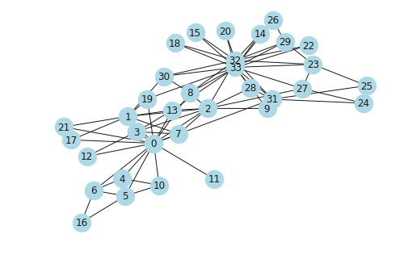
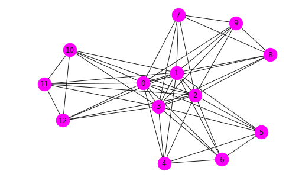
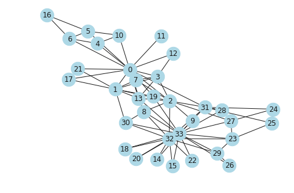

## Algorithm - III

### Operators, Shortest Paths, Trees, Planarity, Flows, Directed Acyclic Graphs, Approximations and Heuristics,  Assortativity


```python
import matplotlib.pyplot as plt
import networkx as nx
import seaborn as sns
sns.set()
%matplotlib inline
```


```python
import warnings
import matplotlib.cbook
warnings.filterwarnings("ignore",category=matplotlib.cbook.mplDeprecation)
```


```python
G = nx.karate_club_graph()
nx.draw(G, node_size = 500, node_color = "lightblue", with_labels = True)
```





### Operators

Unary operations on graphs

- ```complement(G)``` 	Returns the graph complement of G.
- ```reverse(G[, copy])``` 	Returns the reverse directed graph of G.

Operations on graphs including union, intersection, difference.

- ```compose(G, H)``` 	Returns a new graph of G composed with H.
- ```union(G, H[, rename, name])``` 	Return the union of graphs G and H.
- ```disjoint_union(G, H)``` 	Return the disjoint union of graphs G and H.
- ```intersection(G, H)``` 	Returns a new graph that contains only the edges that exist in both G and H.
- ```difference(G, H)``` 	Returns a new graph that contains the edges that exist in G but not in H.
- ```symmetric_difference(G, H)``` 	Returns new graph with edges that exist in either G or H but not both.

Operations on many graphs.

- ```compose_all(graphs)``` 	Returns the composition of all graphs.
- ```union_all(graphs[, rename])``` 	Returns the union of all graphs.
- ```disjoint_union_all(graphs)``` 	Returns the disjoint union of all graphs.
- ```intersection_all(graphs)``` 	Returns a new graph that contains only the edges that exist in all graphs.

Graph products.

- ```cartesian_product(G, H)``` 	Returns the Cartesian product of G and H.
- ```lexicographic_product(G, H)``` 	Returns the lexicographic product of G and H.
- ```rooted_product(G, H, root)``` 	Return the rooted product of graphs G and H rooted at root in H.
- ```strong_product(G, H)``` 	Returns the strong product of G and H.
- ```tensor_product(G, H)``` 	Returns the tensor product of G and H.
- ```power(G, k)``` 	Returns the specified power of a graph.


```python
CG = nx.complement(G)
nx.draw(CG, node_size = 500, node_color = "lightblue", with_labels = True)
```


```python
RG = nx.reverse(nx.to_directed(G))
nx.draw(RG, node_size = 500, node_color = "lightblue", with_labels = True)
```


```python
G = nx.balanced_tree(2,3) 
H = nx.balanced_tree(3,2)

plt.figure(figsize = [20,8])
plt.subplot(1,3,1)
nx.draw(G, node_size = 500,node_color = 'lightblue', with_labels = True)
plt.subplot(1,3,2)
nx.draw(G, node_size = 500,node_color = 'lightgreen', with_labels = True)
plt.subplot(1,3,3)
nx.draw(nx.compose(H,G), node_size = 500, node_color = 'magenta', with_labels = True)
```


```python
G = nx.balanced_tree(3,2)
nx.draw(nx.power(G,k = 3), node_size = 500, node_color = 'magenta', with_labels = True)
```





-------------

### Shortest Paths

Compute the shortest paths and path lengths between nodes in the graph.

These algorithms work with undirected and directed graphs.

- ```shortest_path(G[, source, target, weight, …])``` 	Compute shortest paths in the graph.
- ```all_shortest_paths(G, source, target[, …])``` 	Compute all shortest paths in the graph.
- ```shortest_path_length(G[, source, target, …])``` 	Compute shortest path lengths in the graph.
- ```average_shortest_path_length(G[, weight, method])``` 	Returns the average shortest path length.
has_path(G, source, target) 	Returns True if G has a path from source to target.
Advanced Interface


#### Shortest path algorithms for unweighted graphs.

- ```single_source_shortest_path(G, source[, cutoff])``` 	Compute shortest path between source and all other nodes reachable from source.
- ```single_source_shortest_path_length(G, source)``` 	Compute the shortest path lengths from source to all reachable nodes.
- ```single_target_shortest_path(G, target[, cutoff])``` 	Compute shortest path to target from all nodes that reach target.
- ```single_target_shortest_path_length(G, target)``` 	Compute the shortest path lengths to target from all reachable nodes.
- ```bidirectional_shortest_path(G, source, target)``` 	Returns a list of nodes in a shortest path between source and target.
- ```all_pairs_shortest_path(G[, cutoff])``` 	Compute shortest paths between all nodes.
- ```all_pairs_shortest_path_length(G[, cutoff])``` 	Computes the shortest path lengths between all nodes in G.
- ```predecessor(G, source[, target, cutoff, …])``` 	Returns dict of predecessors for the path from source to all nodes in G


#### Shortest path algorithms for weighed graphs.

- ```dijkstra_predecessor_and_distance(G, source) ```	Compute weighted shortest path length and predecessors.
- ```dijkstra_path(G, source, target[, weight]) ```	Returns the shortest weighted path from source to target in G.
- ```dijkstra_path_length(G, source, target[, weight]) ```	Returns the shortest weighted path length in G from source to target.
- ```single_source_dijkstra(G, source[, target, …]) ```	Find shortest weighted paths and lengths from a source node.
- ```single_source_dijkstra_path(G, source[, …]) ```	Find shortest weighted paths in G from a source node.
- ```single_source_dijkstra_path_length(G, source) 	Find shortest weighted path lengths in G from a source node.
multi_source_dijkstra(G, sources[, target, …])``` 	Find shortest weighted paths and lengths from a given set of source nodes.
- ```multi_source_dijkstra_path(G, sources[, …])``` 	Find shortest weighted paths in G from a given set of source nodes.
- ```multi_source_dijkstra_path_length(G, sources) ```	Find shortest weighted path lengths in G from a given set of source nodes.
- ```all_pairs_dijkstra(G[, cutoff, weight])``` 	Find shortest weighted paths and lengths between all nodes.
- ```all_pairs_dijkstra_path(G[, cutoff, weight]) ```	Compute shortest paths between all nodes in a weighted graph.
- ```all_pairs_dijkstra_path_length(G[, cutoff, …])``` 	Compute shortest path lengths between all nodes in a weighted graph.
- ```bidirectional_dijkstra(G, source, target[, …]) ```	Dijkstra’s algorithm for shortest paths using bidirectional search.
- ```bellman_ford_path(G, source, target[, weight]) ```	Returns the shortest path from source to target in a weighted graph G.
- ```bellman_ford_path_length(G, source, target)``` 	Returns the shortest path length from source to target in a weighted graph.
- ```single_source_bellman_ford(G, source[, …])``` 	Compute shortest paths and lengths in a weighted graph G.
- ```single_source_bellman_ford_path(G, source[, …])``` 	Compute shortest path between source and all other reachable nodes for a weighted graph.
- ```single_source_bellman_ford_path_length(G, source) ```	Compute the shortest path length between source and all other reachable nodes for a weighted graph.
- ```all_pairs_bellman_ford_path(G[, weight]) ```	Compute shortest paths between all nodes in a weighted graph.
- ```all_pairs_bellman_ford_path_length(G[, weight]) ```	Compute shortest path lengths between all nodes in a weighted graph.
- ```bellman_ford_predecessor_and_distance(G, source)``` 	Compute shortest path lengths and predecessors on shortest paths in weighted graphs.
- ```negative_edge_cycle(G[, weight]) ```	Returns True if there exists a negative edge cycle anywhere in G.
- ```goldberg_radzik(G, source[, weight])``` 	Compute shortest path lengths and predecessors on shortest paths in weighted graphs.
- ```johnson(G[, weight]) ```	Uses Johnson’s Algorithm to compute shortest paths.
Dense Graphs


#### Floyd-Warshall algorithm for shortest paths.

- ```floyd_warshall(G[, weight])``` 	Find all-pairs shortest path lengths using Floyd’s algorithm.
- ```floyd_warshall_predecessor_and_distance(G[, …])``` 	Find all-pairs shortest path lengths using Floyd’s algorithm.
- ```floyd_warshall_numpy(G[, nodelist, weight])``` 	Find all-pairs shortest path lengths using Floyd’s algorithm.
- ```reconstruct_path(source, target, predecessors)``` 	Reconstruct a path from source to target using the predecessors dict as returned by floyd_warshall_predecessor_and_distance


#### A* Algorithm

Shortest paths and path lengths using the A* (“A star”) algorithm.

- ```astar_path(G, source, target[, heuristic, …])``` 	Returns a list of nodes in a shortest path between source and target using the A* (“A-star”) algorithm.
- ```astar_path_length(G, source, target[, …])``` 	Returns the length of the shortest path between source and target using t


```python
G = nx.karate_club_graph()
nx.draw(G, node_size = 500, node_color = "lightblue", with_labels = True)
```





```python
nx.shortest_path(G,0,26)
```


    [0, 8, 33, 26]


```python
list(nx.all_shortest_paths(G,0,26))
```


    [[0, 8, 33, 26], [0, 13, 33, 26], [0, 19, 33, 26], [0, 31, 33, 26]]


---------------------------
