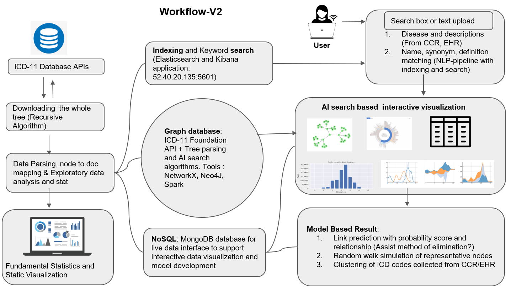

### Cloud Articture and Workflow

This online documents has been prepared for ICD 11 Code Tools development and implementation. The document begins with the setting up of tools and environment required for platform creation. A systematic steps for Indexing, Graph database and NoSQL database integration and development is presented. Implementation of AI search algorithms and development of models are introduced.

Figure : Platform architecture and workflow
        
